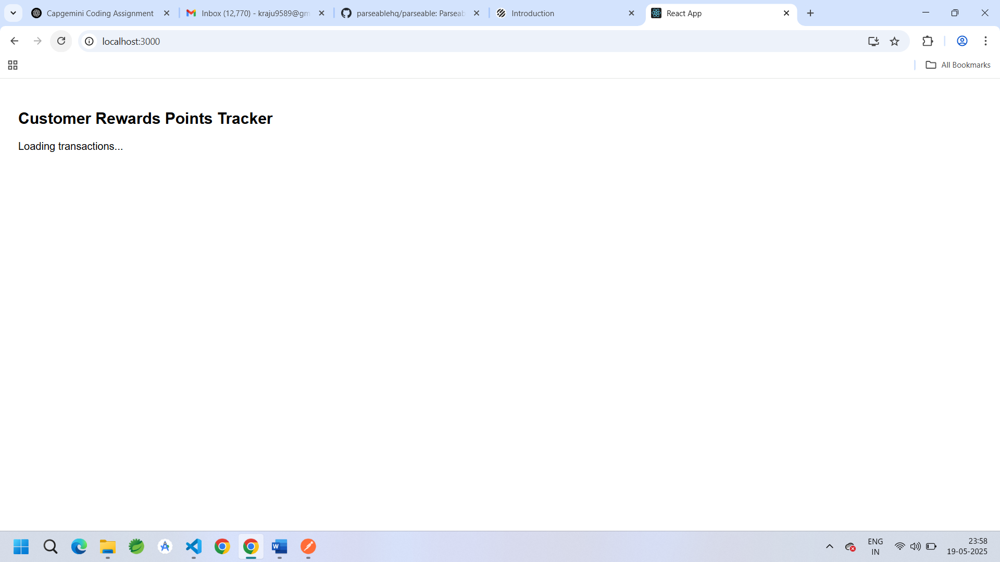
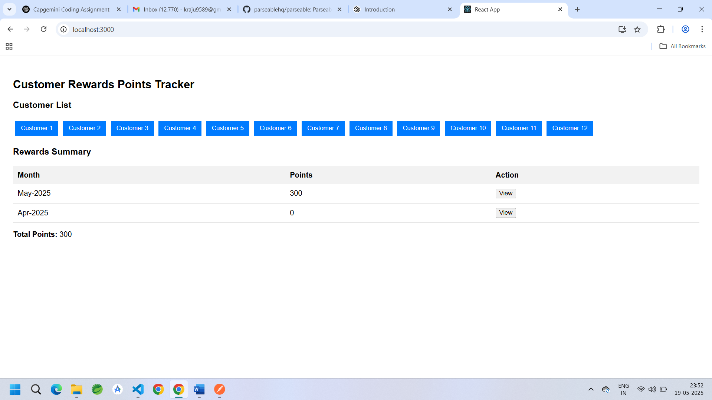
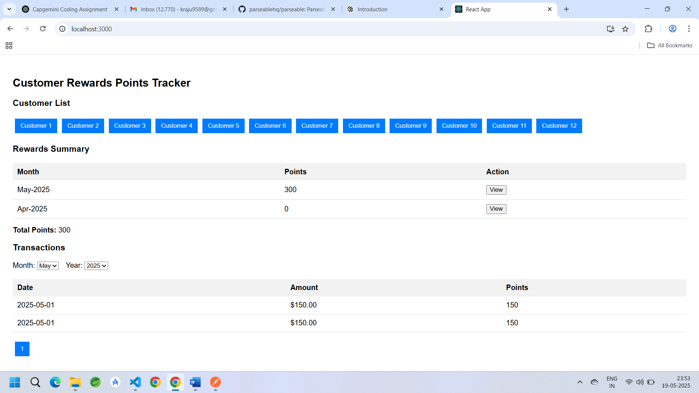
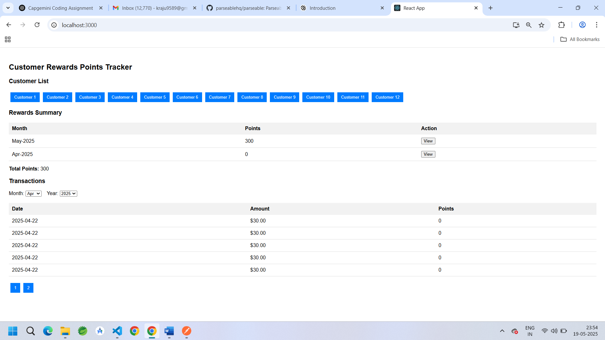
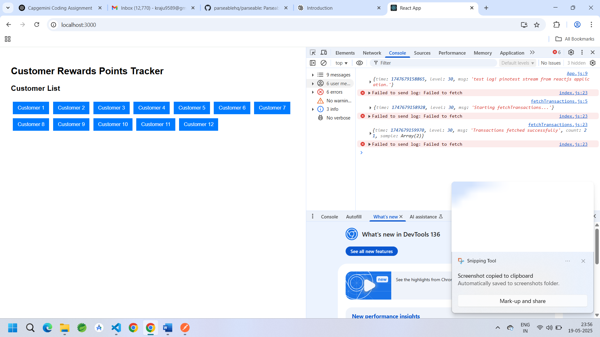
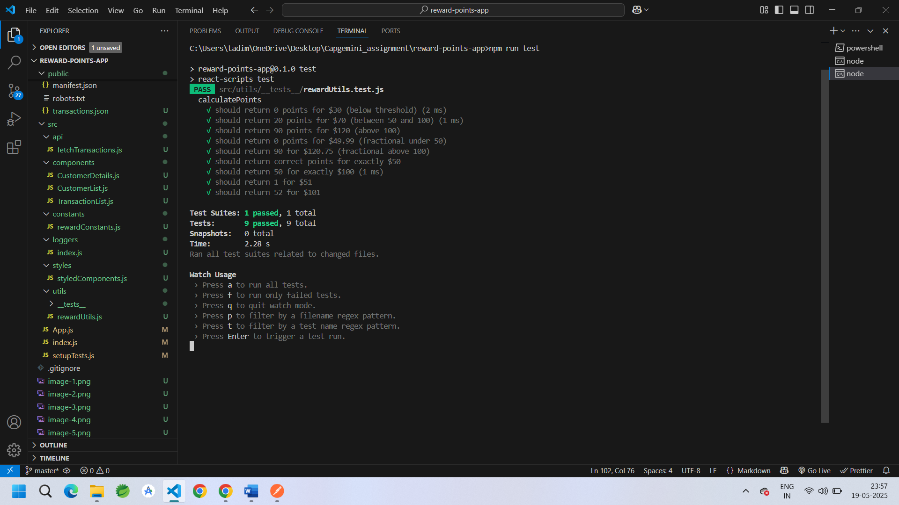

# Customer Rewards Points Tracker

This is a ReactJS-based application simulating a **Retailer Rewards Program** where customers earn reward points based on their purchases. It calculates and displays reward points per transaction, per month, and total points for each customer.

---

## Project Overview

A customer receives:
-  **2 points** for every dollar spent **over $100** in each transaction.
-  **1 point** for every dollar spent **between $50 and $100**.

### Example:
For a $120 transaction:
- 2 x ($120 - $100) = 40 points
- 1 x ($100 - $50) = 50 points  
→ **Total = 90 points**

---

## ✅ Features Implemented

- 🔍 **Customer List**: Displays all customers with basic details.
- 👤 **Customer Selection**: Shows:
  - Monthly reward points
  - Total reward points
- 📅 **Month & Year Filters**:
  - Select from **Jan - Dec**
  - Select years from **2021 to 2025** (default 2025)
  - Defaults to last 3 months
- 📜 **Transaction View**: For selected customer & month, see all transactions and reward points per transaction.
- 🔁 **Pagination**: Implemented for handling large customer/transaction datasets.
- 🧪 **Unit Testing**: Positive and negative cases for:
  - Whole & fractional transaction values
  - Edge reward calculations
- ⚙️ **API Simulation**:
  - Async mock API using local `JSON` file (`/public/transactions.json`)
  - Loading and error handling included
- 🧾 **Logging**:
  - Integrated `pino` logger to send logs to [Parseable](https://demo.parseable.io/)
- 🧱 **Clean Architecture**:
  - Functional components
  - PropTypes validation
  - Dynamic data handling via `props` and `state`
- 🎨 **Styling**:
  - Basic styling via `styled-components`

---

## 🗃️ Project Structure


## 🔧 Features
- Shows reward points earned per customer
- Month and year filters (last 3 months default)
- Transaction view per month
- Simulated async API using local JSON
- Pagination-ready structure
- Logging using console.log/debug
- Styled with Styled Components
- Unit tested with Jest and React Testing Library

## 📦 Setup

```bash
npm install
npm start
```

## 🧪 Run Tests

```bash
npm run test
```

## 📁 Folder Structure

src/
├── components/ # UI Components
├── api/ # Simulated API calls
├── utils/ # Utilities and helper functions
├── constants/ # Static text, month names, etc.
├── tests/ # Unit test cases
├── logger/ # Logging setup with pino
├── App.js
└── index.js
public/
└── transactions.json # Mock data for customers & transactions

## ✅ Screenshots
- Initial loading 

- Working screenshot of app

- When selected a particular customer

- When clicked on View Button in Rewards Summary 

- Pagination to handle large data

- No Transaction found for a paritcular date

- Loggers added using pino getting error sometimes due to api inconsistency

- Success screenshot from test runner

